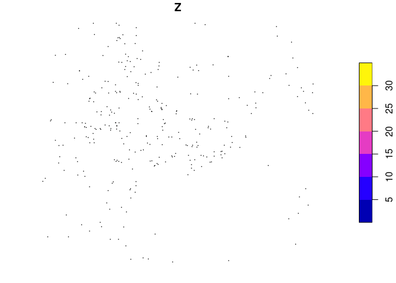
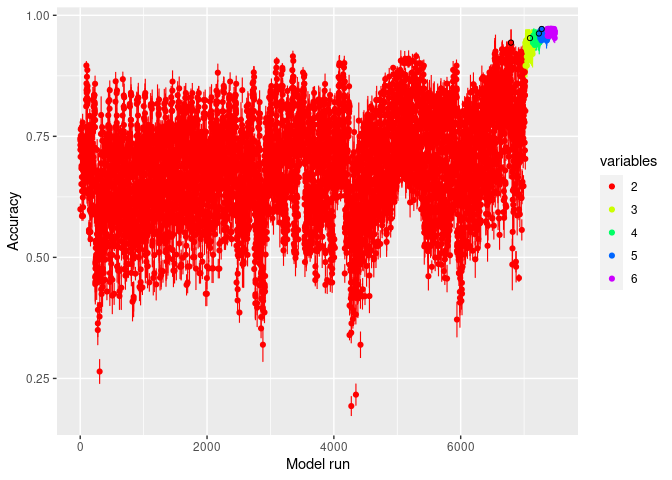
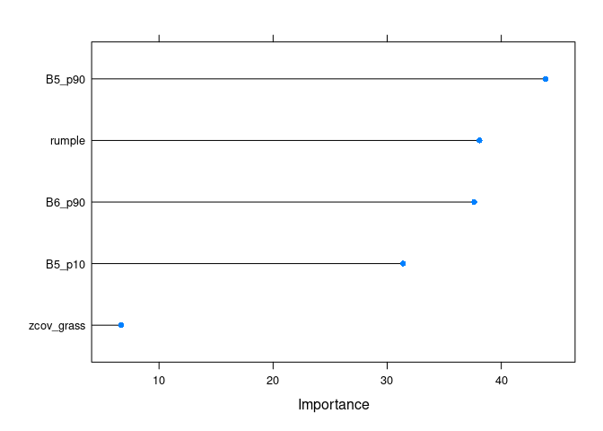
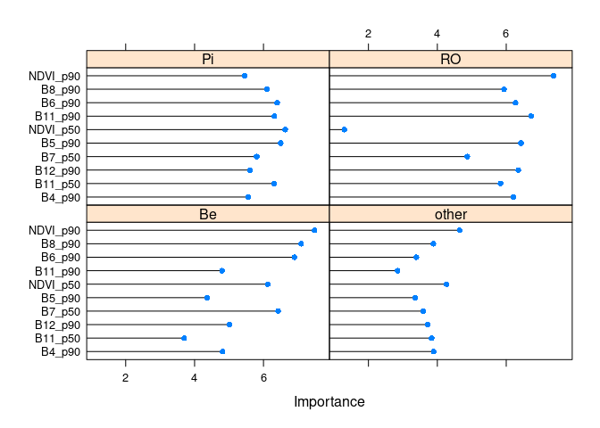
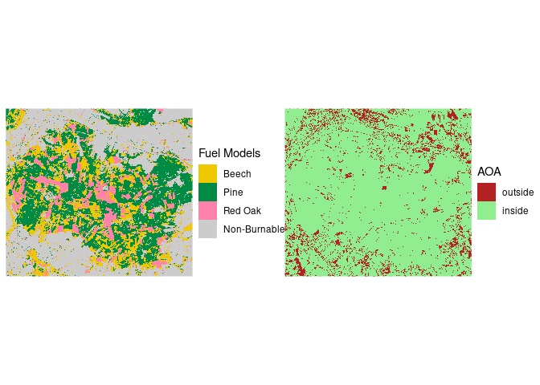

Surface Fuel Classification in the Haard Forest
================
Johannes Heisig

This analysis identifies 3 fuel types in a managed temperate forest
dominated by either Scots pine, red oak or European beech. Field samples
are used for model training. Predictor data comes from airborne LiDAR
and Sentinel-1 & -2.

> NOTE: Binder is great for reproducing analysis in R. However, it has
> RAM restrictions, which can be a problem for large remote sensing data
> stacks. Below we provide switches for this program, which allow you to
> decide, whether you want to run all analysis steps or skip some of the
> computationally expensive ones (e.g. extracting raster values). Be
> prepared that Binder may crash when running complex tasks. If you run
> this script on Binder we suggest you stick with the switch settings
> below (skip.. = TRUE), which allows intermediate results to be loaded
> from existing files. Alternatively, you may choose to download this
> repository and run operations locally instead. In this case feel free
> to change switches below TRUE to FALSE.

Analysis switches:

``` r
skip_training_data_extraction = TRUE
skip_model_training = TRUE
skip_model_prediction = TRUE
```

``` r
suppressPackageStartupMessages({
library(stars)
library(dplyr)
library(caret)
library(CAST)
select = dplyr::select
library(cvms)
library(doParallel)
library(patchwork)
})
knitr::opts_chunk$set(cache=T, warning = F, message = F)
```

## Prepare training and predictor data

### Read

``` r
if (skip_training_data_extraction){
  train = readRDS(file.path(getwd(),"data",
                            "surface_fuels_training_data.rds")) |> 
    st_sf()
} else {
  
  predictors_path = file.path(getwd(),"data","predictors_haard_10m.rds")
  if (! file.exists(predictors_path)){
    download.file("https://uni-muenster.sciebo.de/s/XPEk2uBClq2v3ob/download",
                  predictors_path)
  } else print("Predictor data already on disk.")
    
  p = readRDS(predictors_path)
  t = st_read(file.path(getwd(),"data","LCC_train.geojson"), quiet=T) |> 
    st_set_crs(st_crs(p)) |> 
    st_crop(p) |> 
    mutate(spp = case_when(spp %in% c("Agri", "Bare", 
                                      "Urban", "Water") ~ "other",
                           TRUE ~ spp)) |> 
    print()
  
  # extract predictors at training locations
  train = p[t] |> st_as_sf()
  
  # add species labels
  train = st_join(train, t) %>% st_drop_geometry()
}

plot(train[1])
```

<!-- -->

``` r
dim(train) # 304 observations (rows) in 120 variables (columns)
```

    ## [1] 304 121

``` r
table(train$spp) # distribution of classes
```

    ## 
    ##    Be other    Pi    RO 
    ##    73    89    73    69

``` r
train = train %>% st_drop_geometry()
```

### Fill NAs

``` r
# Many LiDAR metrics have NAs in non-vegetated areas. This leads to problems in model building and prediction. NAs are therefore replaced with zeros.
tr = train %>% replace(is.na(.), 0)
if (!skip_training_data_extraction) p = p %>% replace(is.na(.), 0)
```

### Split

Stratified random sample to keep species class balanced.

``` r
set.seed(1)
train = tr |> group_by(spp) |> sample_frac(0.7) |> ungroup()
test = tr |> setdiff(train)
```

## Modeling

### Model training

``` r
# NOTE:
# If you choose to run the Forward-Feature-Selection
# process, be prepared that this may take 2-3 hours 
# as ~ 14.000 combinations of predictor variables are
# tested. Binder may crash during this process, so we
# advise to run it on your local machine. Afterwards
# you will find the progress log in the drop-down 
# window below the code.

if (skip_model_training){ 
  f = readRDS(file.path(getwd(),"results","models","ffs_model_4class.rds"))
  
} else {
  tc = trainControl("cv", 5) # set up 5-fold random CV
  
  cl <- makeCluster(6) # run in parallel
  registerDoParallel(cl)
  
  set.seed(111)
  f = ffs(select(train, -spp),    # Forward-Feature-Selection
          as.factor(train$spp),
          method = "rf", 
          trControl = tc,
          ntree = 500,
          tuneGrid = data.frame("mtry"=c(2,3,5,7,9,11)),
          verbose = T)
  
  stopCluster(cl)
} 
```

<details>
<summary>
show FFS progress
</summary>
</details>

### Model evaluation

#### FFS variable selection plot

<!-- -->

The FFS process found an optimal combination of 5 predictor variables.

#### Variable Importance

<!-- -->

Temporal aggregates of Sentinel-2 bands as well as LiDAR-derived forest
structure metrics were selected.

#### Model overview

    ## Random Forest 
    ## 
    ## 212 samples
    ##   5 predictor
    ##   4 classes: 'Be', 'other', 'Pi', 'RO' 
    ## 
    ## No pre-processing
    ## Resampling: Cross-Validated (5 fold) 
    ## Summary of sample sizes: 171, 170, 169, 170, 168 
    ## Resampling results across tuning parameters:
    ## 
    ##   mtry  Accuracy   Kappa    
    ##    2    0.9717504  0.9621991
    ##    3    0.9672049  0.9561092
    ##    5    0.9526869  0.9366830
    ##    7    0.9526869  0.9366914
    ##    9    0.9526869  0.9366830
    ##   11    0.9526869  0.9366830
    ## 
    ## Accuracy was used to select the optimal model using the largest value.
    ## The final value used for the model was mtry = 2.

The best model has a hyperparamter `mtry` of 2.

#### Model confusion matrix

    ##       Be other Pi RO class.error
    ## Be    47     0  3  1       0.078
    ## other  0    62  0  0       0.000
    ## Pi     2     0 49  0       0.039
    ## RO     2     0  0 46       0.042

### Comparison: traditional Random Forest approach

#### Code

``` r
if (! skip_model_training){
  tc = trainControl("cv", 5)
  cl <- makeCluster(6)
  registerDoParallel(cl)
  set.seed(1)
  model_all <- train(select(train, -spp),
                     as.factor(train$spp),
                     method = "rf", num.trees = 500,
                     tuneGrid = data.frame("mtry"=f$finalModel$mtry), 
                     importance = TRUE,
                     trControl = tc)
  stopCluster(cl)
} else {
  model_all <- readRDS(file.path(getwd(),"results", "models","rf_model_4class_all.rds"))
}
```

#### Variable Importance

<!-- -->

#### Model overview

    ## Random Forest 
    ## 
    ## 212 samples
    ## 119 predictors
    ##   4 classes: 'Be', 'other', 'Pi', 'RO' 
    ## 
    ## No pre-processing
    ## Resampling: Cross-Validated (5 fold) 
    ## Summary of sample sizes: 170, 169, 170, 169, 170 
    ## Resampling results:
    ## 
    ##   Accuracy   Kappa    
    ##   0.9434109  0.9242268
    ## 
    ## Tuning parameter 'mtry' was held constant at a value of 2

#### Model confusion matrix

    ##       Be other Pi RO class.error
    ## Be    44     0  3  4       0.137
    ## other  0    62  0  0       0.000
    ## Pi     2     0 49  0       0.039
    ## RO     2     0  0 46       0.042

### Conclusion

Forward Feature Selection was able to reduce the number of predictor
variables to 5 (vs. 119) and still increase accuracy by \~2.8% (97.2%
vs. 94.3%) and Kappa by \~3.8% (96.2% vs. 92.4%).

## Validation

``` r
pred = predict(f, newdata = test)
confusionMatrix(pred, as.factor(test$spp))
```

    ## Confusion Matrix and Statistics
    ## 
    ##           Reference
    ## Prediction Be other Pi RO
    ##      Be    20     0  2  2
    ##      other  0    26  0  0
    ##      Pi     0     0 19  1
    ##      RO     2     0  0 18
    ## 
    ## Overall Statistics
    ##                                           
    ##                Accuracy : 0.9222          
    ##                  95% CI : (0.8463, 0.9682)
    ##     No Information Rate : 0.2889          
    ##     P-Value [Acc > NIR] : < 2.2e-16       
    ##                                           
    ##                   Kappa : 0.896           
    ##                                           
    ##  Mcnemar's Test P-Value : NA              
    ## 
    ## Statistics by Class:
    ## 
    ##                      Class: Be Class: other Class: Pi Class: RO
    ## Sensitivity             0.9091       1.0000    0.9048    0.8571
    ## Specificity             0.9412       1.0000    0.9855    0.9710
    ## Pos Pred Value          0.8333       1.0000    0.9500    0.9000
    ## Neg Pred Value          0.9697       1.0000    0.9714    0.9571
    ## Prevalence              0.2444       0.2889    0.2333    0.2333
    ## Detection Rate          0.2222       0.2889    0.2111    0.2000
    ## Detection Prevalence    0.2667       0.2889    0.2222    0.2222
    ## Balanced Accuracy       0.9251       1.0000    0.9451    0.9141

## Surface fuel model prediction

``` r
if (skip_model_prediction){
  lcc = read_stars(file.path(getwd(),"results",
                             "haard_surface_fuel_map.tif")) |> 
    setNames("prediction") |> 
    mutate(prediction = 
             case_when(prediction == 4 ~ "Non-Burnable",
                       prediction == 2 ~ "Pine",
                       prediction == 1 ~ "Beech",
                       prediction == 3 ~ "Red Oak",
                       TRUE ~ as.character(prediction)) |> 
             factor(levels = c("Beech", "Pine", 
                               "Red Oak", "Non-Burnable")))
} else {
  if (!file.exists("")) download.file()
  #download predictor
  p = read_rds(file.path(getwd(),"data",
                         "predictors_haard_10m.rds")) |> 
    replace(is.na(.), 0)
  
  # spatial prediction
  lcc = predict(split(p, 3), f)
  
  lcc = lcc %>% 
    mutate(pred_sum = 
             case_when(prediction %in% c("other") ~ "Non-Burnable",
                       prediction == "Pi" ~ "Pine",
                       prediction == "Be" ~ "Beech",
                       prediction == "RO" ~ "Red Oak",
                       TRUE ~ as.character(prediction)),
           pred_sum = factor(pred_sum, 
                             levels = c("Beech", "Pine", 
                                        "Red Oak", "Non-Burnable")))
  write_stars(lcc, layer = 2, overwrite=T,
              dsn = file.path(getwd(),"results",
                              "haard_surface_fuel_map.tif"))
}

lcc
```

    ## stars object with 2 dimensions and 1 attribute
    ## attribute(s):
    ##        prediction     
    ##  Beech       :170198  
    ##  Pine        :274689  
    ##  Red Oak     : 93009  
    ##  Non-Burnable:362104  
    ## dimension(s):
    ##   from   to  offset delta                       refsys point values x/y
    ## x    1 1000  372000    10 +proj=utm +zone=32 +ellps... FALSE   NULL [x]
    ## y    1  900 5733000   -10 +proj=utm +zone=32 +ellps... FALSE   NULL [y]

Plot

``` r
gg = ggplot() +
  coord_equal() +
  theme_void() +
  scale_x_discrete(expand=c(0,0)) +
  scale_y_discrete(expand=c(0,0))

pfm = gg + 
  geom_stars(data=lcc[1,,]) +
  scale_fill_manual(name="Fuel Models",
                    values=c("gold2", "springgreen4", 
                             "palevioletred1", "grey80"))
```

Area of Applicability

``` r
if (skip_model_prediction){
  AOA = read_stars(file.path(getwd(),"results",
                             "AOA_haard_surface_fuel_map.tif")) |> 
    setNames("AOA")
} else {
  AOA = aoa(model=f, newdata=p)
  write_stars(AOA["AOA"],file.path(getwd(),"results",
                                   "AOA_haard_fuelmodel.tif"))
}

AOA = mutate(AOA, AOA = factor(AOA, levels = c(0,1), 
                               labels = c("outside","inside")))

paoa = gg +
  geom_stars(data = AOA["AOA"]) +
  scale_fill_manual(values=c("firebrick","lightgreen"), name = "AOA")

pfm + paoa
```

<!-- -->

This plot refers to Figure 6 of our paper.

``` r
# Which percentage of pixels fall outside the AOA?
round(sum(AOA$AOA == 'outside') / length(AOA$AOA),4)*100
```

    ## [1] 11.44

About 11.44% of cells fall outside the AOA. However, this mainly
concerns non-forested areas.

------------------------------------------------------------------------

*From section 4.1 in [Heisig et
al. 2022](https://doi.org/10.3390/fire5010029):*

> “The FFS process found the best performing solution among 13,924
> possible combinations of predictor variables. CV selected an optimal
> mtry of 2 and reported an OA of 0.971 with a Kappa of 0.967. The final
> model consisted of five variables, with *B*05<sub>*p*90</sub> being
> the most important one. *B*06<sub>*p*90</sub> and Rumple also scored
> high variable importance, followed by *B*05<sub>*p*10</sub>. Finally,
> *Z*<sub>*c**o**v**g*</sub> was only able to add very little
> improvement to the model. FFS successfully reduced the number of
> predictors significantly (5 vs. 119) while keeping model performance
> high. For comparison, a classic random forest model was built, using
> all available predictors. Performance was still high, but both OA and
> Kappa decreased by 2.8% and 3.8%, respectively. The model confusion
> matrix revealed a perfect classification of non-burnable areas. This
> may be explained by noticeable differences in the spectral signatures
> and vertical structure of non-burnable land cover (e.g., water bodies,
> urban area) compared to forest vegetation. Minor confusion was found
> between tree species classes. Errors ranged between 4% and 8%, with
> beech having slightly larger errors than pine and red oak. Previously
> separated validation samples (n = 90) were tested on the model
> prediction. All samples were classified correctly, yielding an OA and
> Kappa of 1.0. Overall, the fuel model classification results were very
> good. However, this could be expected, as it was a simple modeling
> task combined with a large range of powerful predictors. The final
> prediction is shown in Figure 6 alongside with the AOA. The
> dissimilarity of predictors from the training samples was only
> critical in areas less relevant for fire spread. Fewer than 1% of
> burnable pixels fell outside the AOA and represented mainly roads,
> bare ground or vegetation along water bodies. These areas are often
> located in close proximity to the forest edge or to existing fire
> barriers, which makes them less relevant for fire spread modeling.”
