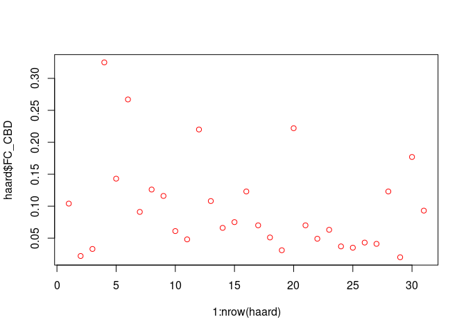
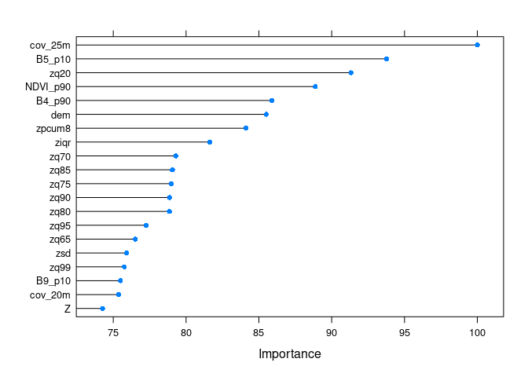
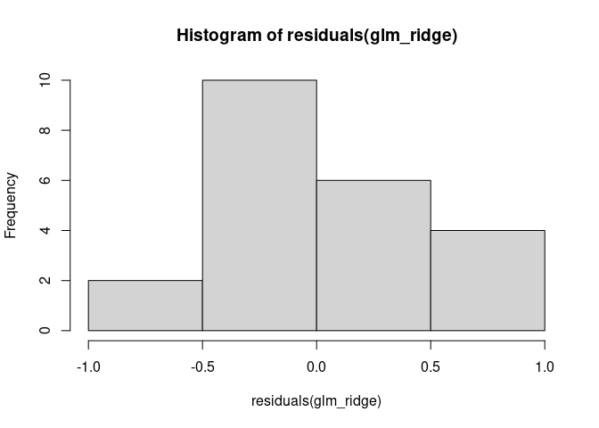
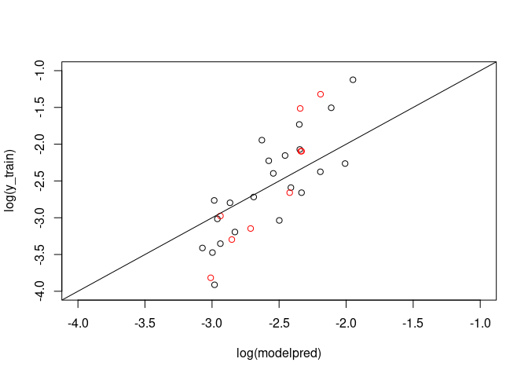
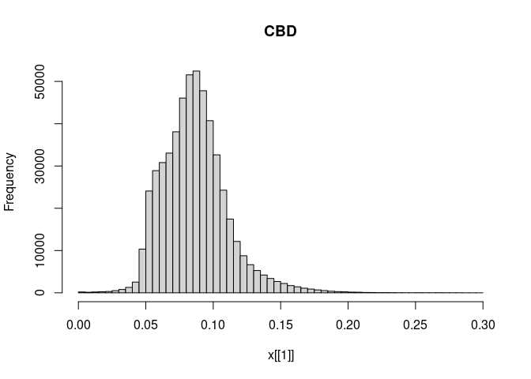
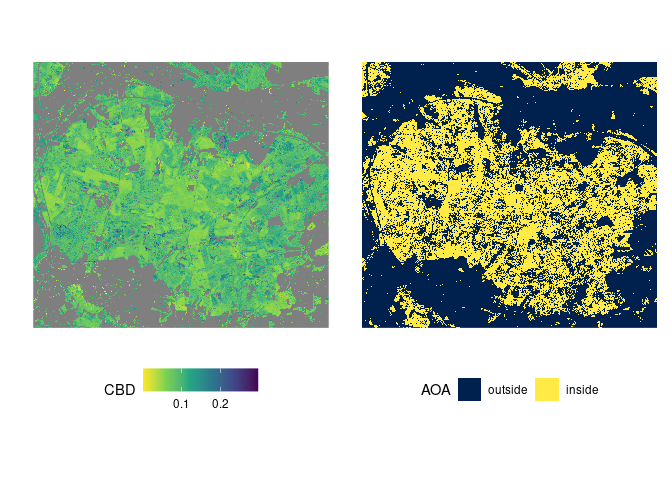

Modeling Crown Bulk Density via Ridge Regression
================
Johannes Heisig

This analysis predicts Crown Bulk Density, a canopy fuel variable
relevant to crown fire spread. It is difficult to sample in the field
and therefore estimated using measurements of other forest structure
variables and allometric equations. Predictor data for this regression
analysis comes from airborne LiDAR and Sentinel-1 & -2.

> NOTE: Binder is great for reproducing analysis in R. However, it has
> RAM restrictions, which can be a problem for large remote sensing data
> stacks. Below we provide switches for this program, which allow you to
> decide, whether you want to run all analysis steps or skip some of the
> computationally expensive ones (e.g. extracting raster values).
> Alternatively, intermediate results are loaded from existing files.
> You may choose to download this repository and run operations locally
> instead.

``` r
skip_training_data_extraction = T
skip_model_prediction = T

suppressPackageStartupMessages({
library(glmnet)
library(caret)
library(CAST)
library(dplyr)
select = dplyr::select
library(tidyr)
library(ggplot2)
library(stars)
library(sf)
library(parallel)
library(doParallel)
library(patchwork)
})
knitr::opts_chunk$set(cache=T, warning = F, message = F)
```

## Prepare training and predictor data

### Read

``` r
if (skip_training_data_extraction){
  haard = readRDS("data/cbd_training_data.rds") |> 
    st_sf() |> 
    select(-c(PlotID, FC_CBH, FC_SH, FC_CC))
} else {
  
  predictors_path = "data/predictors_haard_10m.rds"
  if (! file.exists(predictors_path)){
    download.file("https://uni-muenster.sciebo.de/s/XPEk2uBClq2v3ob/download",
                  predictors_path)
  } else print("Predictor data already on disk.")
  
  p = readRDS("data/predictors_haard_10m.rds") 
  dim(p)
  
  haard = st_read("data/haard_field_plot_locations.csv", crs=4326, quiet=T,
                  options=c("X_POSSIBLE_NAMES=lon","Y_POSSIBLE_NAMES=lat")) |>
    select(plot_id, dom_spp)
  
  FC = read.csv("data/haard_cbd_fuelcalc.csv")[-1,] |> 
    select(PlotID, preCBD, preCBH, preSH, preCC) |> 
    mutate(PlotID = sub(x=PlotID, "-Inventory", "") |> as.numeric(),
           across(2:5, as.numeric)) |> 
    rename_with(~sub("pre","FC_",.x)) |> 
    drop_na() |> 
    glimpse()
}

ft = read_stars("results/haard_surface_fuel_map.tif") |> 
  setNames("FuelType")
```

### Extract

``` r
if (!skip_training_data_extraction){
  # Create buffer around visited field plots according to survey protocol
  haard = haard[haard$plot_id %in% FC$PlotID,] |> 
    st_transform(st_crs(p)) |> 
    st_buffer(10)
  
  #' Convert raster data to polygon geometries to enable
  #' intersection rather than pixel-based extraction.
  #' Extract area-weighted values from predictors at plot
  #' locations. First intersect buffers with predictors,
  #' then weight each fragment of a field plot by its 
  #' area in relation to plot size (pi*(10m)² = 314 m²)
  
  haard = st_intersection(st_as_sf(p), haard)
  haard = haard |> 
    mutate(across(-c(plot_id, dom_spp, geometry), 
                  ~as.numeric(.x * st_area(haard)/314))) |> 
    group_by(plot_id) |> 
    summarise(across(where(is.numeric), 
                     function(s) round(sum(s),2)), 
              dom_spp = unique(dom_spp))
  
  # join with target variable (CBD) based on field plot ID
  haard = FC |> 
    mutate(plot_id = as.character(PlotID)) |> 
    select(plot_id, FC_CBD) |> 
    inner_join(haard, by = "plot_id") |> 
    select(-plot_id, -dom_spp) |> 
    st_sf()
}

haard = st_drop_geometry(haard)

# CBD field samples
plot(1:nrow(haard), haard$FC_CBD, col="red")
```

<!-- -->

### Fill NAs

``` r
any(colSums(is.na(haard)) > 0) # no NAs in training point data
```

    ## [1] FALSE

``` r
if (!skip_training_data_extraction){
  # how many NAs in which predictor?
  p.nas = colSums(is.na(as.data.frame(split(p))))
  p.nas[p.nas > 0] 
  
  # ==> NAs mainly in Z-related variables --> can be filled with zeros 
  
  # where in space are NAs?
  p.nas.st = st_apply(p, 1:2, function(x) sum(is.na(x)))
  plot(p.nas.st, breaks = "equal", 
       col = rev(terrain.colors(10)),
       main = "\nNumber of\nmissing predictor values per pixel")
  
  # ==> almost exclusively in non-forest areas --> less of a problem
  
  p = p %>% replace(is.na(.), 0)
}
```

### Split into training and test sets

``` r
set.seed(111)
training = haard |> sample_frac(0.7)
testing = haard |> setdiff(training)

x_train = model.matrix(FC_CBD ~ ., training)[,-1]   # predictors
x_test = model.matrix(FC_CBD ~ ., testing)[,-1]

y_train = training$FC_CBD                           # target
y_test = testing$FC_CBD
```

### Remove zero variance predictors

``` r
(zerovar = which(apply(scale(x_train), 2, FUN = function(x) {all(is.na(x))})))
```

    ##   zq15 B1_p10 B1_p50 
    ##     45     84     85

``` r
x_train = x_train[,-zerovar]
x_test = x_test[,-zerovar]
if (!skip_training_data_extraction) p = p[,,,-zerovar] 
```

## Ridge regression with `caret` and `glmnet`

Prepare model training components:

-   A simple 5-fold random CV is used for assessment of model
    performance

-   Parameter `lambda` needs to be tuned through cross-validation. We
    use a tune grid with 100 possible values between 100 and 0.1.

-   Alpha (`a`) determines whether the model performs Ridge regression
    (`a = 0`), a Lasso regression (`a = 1`), or an Elasticnet regression
    (`0 < a > 1`).

-   Predictor variables (`p`) are translated from a `stars`-object to a
    matrix for model prediction.

``` r
tc = trainControl("cv", 5)
grid = 10^seq(2, -1, length = 100)
a = 0
if (!skip_training_data_extraction){
  newx = p |> 
    split(3) |> 
    as.data.frame() |> 
    select(-x,-y) |> 
    as.matrix()
}
```

### Ridge regression log(CBD)

The `caret` modeling framework will be used as a wrapper for `glmnet`.

``` r
set.seed(111)
glm_ridge = train(
  x_train,
  log(y_train),
  method = "glmnet",
  preProcess = c("center", "scale"),
  tuneGrid = data.frame(lambda=grid, alpha=0), 
  trControl = tc,
  importance = T)

#saveRDS(glm_ridge, "results/models/model_log_cbd_ridge.rds")
```

### Validation log(CBD)

``` r
best_lambda = glm_ridge$bestTune$lambda
glm_ridge$results[glm_ridge$results$lambda == best_lambda,]
```

    ##    alpha   lambda     RMSE  Rsquared       MAE    RMSESD RsquaredSD     MAESD
    ## 68     0 10.72267 0.556071 0.5552489 0.4772372 0.1789304  0.3530629 0.1258923

``` r
modelpred = glm_ridge |> 
  predict(s = best_lambda) |> 
  exp()
testpred = glm_ridge |> 
  predict(s = best_lambda, newdata = x_test) |> 
  exp() 
print(round(testpred,3))
```

    ##     1     2     3     4     5     6     7     8     9 
    ## 0.049 0.112 0.096 0.097 0.053 0.089 0.058 0.066 0.096

``` r
R2(modelpred, y_train) # R2 (model prediction vs training data)
```

    ## [1] 0.5971699

``` r
R2(testpred, y_test) # R2 (prediction vs validation data)
```

    ## [1] 0.7348898

``` r
RMSE(modelpred, y_train) # RMSE (model prediction vs training data)
```

    ## [1] 0.05388306

``` r
RMSE(testpred, y_test) # RMSE (prediction vs validation data)
```

    ## [1] 0.06903226

``` r
RMSE(mean(y_train), y_test) # RMSE (intercept only model)
```

    ## [1] 0.08210538

``` r
plot(varImp(glm_ridge), top=20) 
```

<!-- -->

``` r
shapiro.test(residuals(glm_ridge))
```

    ## 
    ##  Shapiro-Wilk normality test
    ## 
    ## data:  residuals(glm_ridge)
    ## W = 0.97532, p-value = 0.8295

``` r
hist(residuals(glm_ridge))
```

<!-- -->

``` r
plot(log(modelpred), log(y_train), 
     xlim=c(-4,-1), ylim=c(-4,-1))
points(log(testpred),log(y_test), col="red")
abline(0,1)
```

<!-- -->

``` r
lambda_index = which(glm_ridge$results$lambda == best_lambda)
coef(glm_ridge$finalModel)[,lambda_index] |> 
  sort(decreasing = T)
```

    ##        cov_25m       NDVI_p90         zpcum8        cov_20m         B5_p10 
    ##   8.589786e-03   7.765810e-03   7.551110e-03   7.065261e-03   6.598638e-03 
    ##         B9_p10        cov_15m        cov_30m          cover   cov_30m_plus 
    ##   6.027070e-03   5.650038e-03   5.615321e-03   5.407282e-03   5.405789e-03 
    ##         B7_p10          zkurt         B8_p10         cov_8m         cov_7m 
    ##   5.008443e-03   4.911439e-03   4.719062e-03   4.469104e-03   4.374511e-03 
    ##      zcov_tree         zpcum7         cov_9m   pzabovezmean        cov_10m 
    ##   4.366869e-03   3.996367e-03   3.951544e-03   3.924434e-03   3.760507e-03 
    ##         B6_p10    zmean_grass    zmean_shrub         VH_p50         VH_p10 
    ##   3.540731e-03   3.396566e-03   3.346739e-03   3.321214e-03   3.314947e-03 
    ##         cov_6m        B12_p50        B12_p10         B3_p10         VH_p90 
    ##   2.955332e-03   2.421877e-03   2.417216e-03   2.227210e-03   2.185131e-03 
    ##         B4_p10         cov_5m         B9_p90         zpcum6           zq25 
    ##   2.165452e-03   1.925761e-03   1.562989e-03   1.416798e-03   1.311937e-03 
    ##     zcov_shrub         cov_4m           zq30         zpcum5         B6_p50 
    ##   1.235259e-03   1.127762e-03   7.244414e-04   7.021985e-04   6.890991e-04 
    ##       cov_3.5m         B8_p90         B7_p90              D         cov_3m 
    ##   6.470897e-04   4.640204e-04   4.211512e-04   3.981953e-04   3.179441e-04 
    ##         zpcum2         B8_p50        B11_p10        B11_p50         zpcum4 
    ##   2.491043e-04   1.227398e-04   1.004822e-04  -1.334253e-05  -5.719775e-05 
    ##     zcov_grass       cov_0.4m         B4_p50       cov_0.5m         zpcum3 
    ##  -1.261444e-04  -1.363407e-04  -1.408502e-04  -1.481716e-04  -1.845071e-04 
    ##       pzabove2       NDVI_p10       cov_1.5m       cov_2.5m         VV_p10 
    ##  -1.854629e-04  -2.829398e-04  -2.877925e-04  -3.179764e-04  -3.332955e-04 
    ##         B3_p50         cov_1m         B9_p50         zpcum1         B6_p90 
    ##  -4.000011e-04  -4.278860e-04  -4.628147e-04  -4.651159e-04  -4.832626e-04 
    ##         VV_p50         cov_2m            cbh         aspect         B7_p50 
    ##  -6.363807e-04  -6.617142e-04  -1.026951e-03  -1.090726e-03  -1.119400e-03 
    ##           zq35            zcv         VV_p90         cov_0m          zskew 
    ##  -1.149858e-03  -1.178821e-03  -1.301041e-03  -1.365768e-03  -1.756174e-03 
    ##         B2_p10       NDVI_p50              N         B5_p50         B3_p90 
    ##  -1.791889e-03  -1.897309e-03  -2.271493e-03  -3.443341e-03  -3.521321e-03 
    ## VVVH_ratio_p10          slope       zentropy           zq40         B2_p90 
    ##  -3.845969e-03  -4.063651e-03  -4.090790e-03  -4.133946e-03  -4.598607e-03 
    ## VVVH_ratio_p90        pground           zq45         B5_p90        B11_p90 
    ##  -5.248388e-03  -5.405935e-03  -5.595980e-03  -5.691376e-03  -6.026466e-03 
    ##         B2_p50        B12_p90 VVVH_ratio_p50         B1_p90            dem 
    ##  -6.138913e-03  -6.151091e-03  -6.154383e-03  -6.223940e-03  -6.236798e-03 
    ##           zq20           zq50           zq55       vert_gap     zmean_tree 
    ##  -6.529452e-03  -6.661062e-03  -6.695292e-03  -6.752985e-03  -6.797544e-03 
    ##         rumple          zmean           zmax              Z           zq60 
    ##  -6.832287e-03  -6.847241e-03  -6.916992e-03  -6.932715e-03  -6.938348e-03 
    ##           zq99            zsd         B4_p90           zq65           zq95 
    ##  -7.028331e-03  -7.122703e-03  -7.135953e-03  -7.177020e-03  -7.191010e-03 
    ##           zq90           zq80           zq85           zq75           zq70 
    ##  -7.321122e-03  -7.342597e-03  -7.348164e-03  -7.358602e-03  -7.374379e-03 
    ##           ziqr    (Intercept) 
    ##  -7.502296e-03  -2.578066e+00

## Prediction log(CBD)

-   Predict and back-transform to normal scale.

-   Set CBD of non-burnable areas to NA.

-   Calculate the Area of Applicability (AOA).

-   Finally, 117 values (0.013 %) ranging between 0.3 and 10^13 remain.
    They are considered to be unreasonable for CBD and are also set to
    NA.

``` r
if(skip_model_prediction){
  (cbd_glm_st = read_stars("results/haard_CBD.tif") |> 
     setNames("CBD"))
} else {
  cbd_glm = predict(glm_ridge, newdata = newx) |> 
    exp() |> 
    setNames("CBD")
  
  cbd_glm_st = ft |> 
    mutate(CBD = cbd_glm,   
           CBD = case_when(FuelType == 4 ~ NaN,   
                           CBD > 0.3 ~ NaN,
                           TRUE ~ CBD)) |> 
    select(CBD)
}
```

    ## stars object with 2 dimensions and 1 attribute
    ## attribute(s):
    ##              Min.    1st Qu.     Median       Mean    3rd Qu.      Max.   NA's
    ## CBD  7.414872e-14 0.07014109 0.08498263 0.08649818 0.09911616 0.2981278 362132
    ## dimension(s):
    ##   from   to  offset delta                       refsys point values x/y
    ## x    1 1000  372000    10 +proj=utm +zone=32 +ellps... FALSE   NULL [x]
    ## y    1  900 5733000   -10 +proj=utm +zone=32 +ellps... FALSE   NULL [y]

``` r
# Distribution of predicted CBD
hist(cbd_glm_st, breaks=100)
```

<!-- -->

AOA

``` r
if(skip_model_prediction){
  (AOA = read_stars("results/AOA_haard_CBD.tif") |> 
     setNames("AOA"))
} else {
  cl <- makeCluster(6)
  registerDoParallel(cl)
  
  AOA = aoa(model=glm_ridge, newdata=p, cl = cl)
  
  stopCluster(cl)
}
```

    ## stars object with 2 dimensions and 1 attribute
    ## attribute(s):
    ##      Min. 1st Qu. Median      Mean 3rd Qu. Max.
    ## AOA     0       0      0 0.3960178       1    1
    ## dimension(s):
    ##   from   to  offset delta                       refsys point values x/y
    ## x    1 1000  372000    10 +proj=utm +zone=32 +ellps... FALSE   NULL [x]
    ## y    1  900 5733000   -10 +proj=utm +zone=32 +ellps... FALSE   NULL [y]

Plot

``` r
pcbd = ggplot() + 
  geom_stars(data = cbd_glm_st, downsample = 1) +
  coord_fixed() + 
  scale_x_discrete(expand = c(0, 0), name="") +
  scale_y_discrete(expand = c(0, 0), name="") +
  scale_fill_viridis_c(direction = -1) +
  theme(legend.position = "bottom")

AOA = AOA |> mutate(AOA = factor(AOA, levels = c(0,1), 
                                 labels = c("outside", "inside")))
paoa = ggplot() + 
  geom_stars(data = AOA["AOA"], downsample = 2) +
  coord_equal() + 
  scale_x_discrete(expand = c(0, 0), name="") +
  scale_y_discrete(expand = c(0, 0), name="") +
  scale_fill_viridis_d(option = "E")+
  theme(legend.position = "bottom")

pcbd + paoa
```

<!-- -->

About 60.4% of cells fall outside the AOA. However, this mainly concerns
non-forested areas.
